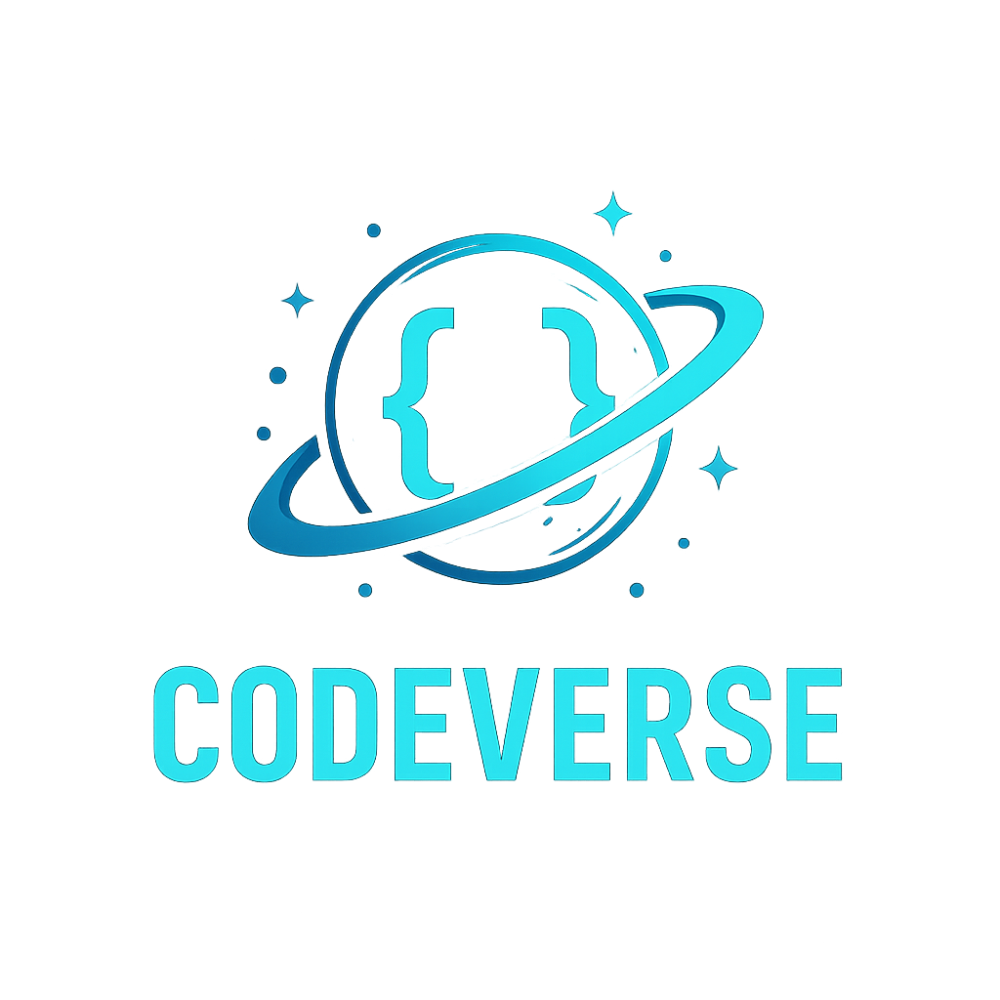

<p align="center">
  
</p>

# ⚡️ CodeVerse – Online Judge Platform


> **CodeVerse** is a secure, real-time Online Judge built using **Django**, **PostgreSQL**, and **subprocess-based execution**.  
> It supports multiple languages including **Python**, **C**, **C++**, and **Java**, with a powerful Monaco editor and custom verdict system.

---

## 🚀 Key Features

* ✅ Custom User Model (full name, timestamps)
* ✅ PostgreSQL integration with Django ORM
* ✅ Admin panel to **add/edit/delete problems**
* ✅ Promote/Demote users to admin
* ✅ Problem listing + Problem detail with code submission
* ✅ Live verdict system: `AC`, `WA`, `TLE`, `MLE`, `RTE`, `CE`
* ✅ Memory and Time limits enforced (e.g. 128MB, 5s cap)
* ✅ Online compiler (non-submission, testing-only)
* ✅ Monaco Editor (syntax highlighting, theme, autosize)
* ✅ AI Debug Assistant (planned)
* ✅ Tab Switch Detection (planned anti-cheating)
* ✅ Responsive Galaxy-themed UI with stylish verdict boxes

---

## 🧠 Current Branch: `main`

> All previous branches like `monaco-integration-started` have been **merged into `main`** and deleted.

---

## 🔭 Roadmap: Upcoming Milestones

| Phase | Feature                                            | Status        |
| ----- | -------------------------------------------------- | ------------- |
| ✅ 1   | PostgreSQL Setup                                   | ✔️ Complete    |
| ✅ 2   | Custom User Model + Admin Panel                    | ✔️ Complete    |
| ✅ 3   | Problem Pages + Basic Submission UI                | ✔️ Complete    |
| ✅ 4   | User Authentication                                | ✔️ Complete    |
| ✅ 5   | Verdict System (with Memory, Time, Runtime checks) | ✔️ Complete    |
| ✅ 6   | Monaco Editor Integration                          | ✔️ Complete    |
| 🔜 7   | Leaderboard                                        | 🔄 In Progress |
| 🔜 8   | Tab Switch Detection (JS Visibility API)           | 🔜 Planned     |
| 🔜 9   | AI Debug Assistant (OpenAI or Gemini API)          | 🔜 Planned     |
| 🔜 10  | Docker + EC2 Deployment                            | 🔜 Planned     |

---

## 🧰 Tech Stack

| Layer          | Tech Used                                                                   |
| -------------- | --------------------------------------------------------------------------- |
| Backend        | Django 5.2                                                                  |
| Database       | PostgreSQL 16                                                               |
| Code Execution | Python `subprocess` (Docker sandboxing planned)                             |
| Languages      | Python 3, C, C++, Java (JDK)                                                |
| Frontend       | Bootstrap 5, custom CSS, Fira Code font                                     |
| Editor         | Monaco Editor (theme, layout, code parsing)                                 |
| Admin Tools    | Promote/demote users, manage problems via `/manage/`                        |
| File Handling  | Organized into `submission_files/runs/` and `submission_files/submissions/` |
| Deployment     | Local dev (Docker + AWS planned)                                            |

---

## ⚙️ System Requirements (Manual)

Make sure these are installed **system-wide** (not just in `venv`):

| Language   | Required Tools  | How to Install                                                                                            |
| ---------- | --------------- | --------------------------------------------------------------------------------------------------------- |
| Python     | `python3` / `python` | [Download](https://www.python.org/downloads/) and install                                          |
| C          | `gcc`           | ✅ Linux/macOS: pre-installed<br>🪟 Windows: Install [MinGW](https://www.mingw-w64.org/) and add to PATH    |
| C++        | `g++`           | ✅ Same as above                                                                                           |
| Java       | `javac`, `java` | [Adoptium JDK](https://adoptium.net) or [Oracle JDK](https://www.oracle.com/java/technologies/downloads/) |
| PostgreSQL | `psql`          | [Download](https://www.postgresql.org/download/) and install                                              |

---

## 🔎 Check Tool Versions

### 🐧 Linux / macOS

```bash
gcc --version
g++ --version
javac -version
java -version
psql --version
python3 --version
````

### 🪟 Windows (CMD / PowerShell)

```cmd
gcc --version
g++ --version
javac -version
java -version
psql --version
python --version  :: use `python`, not `python3` on most Windows setups
```

---

## 🛠️ Local Development Setup

### 🐧 Linux / macOS

```bash
git clone https://github.com/gsri-18/Summer-Project.git
cd Summer-Project

python3 -m venv codeverse-env
source codeverse-env/bin/activate

pip install -r requirements.txt
python manage.py migrate
python manage.py createsuperuser   # 🔐 Create your first admin user
python manage.py runserver
```

### 🪟 Windows (CMD)

```cmd
python -m venv codeverse-env
codeverse-env\Scripts\activate

pip install -r requirements.txt
python manage.py migrate
python manage.py createsuperuser   :: 🔐 Create your first admin user
python manage.py runserver
```

---

## 🔐 Why You Need a Superuser (a.k.a. Admin)

While regular users can **submit problems and view verdicts**, only superusers can:

* Add/edit/delete problems
* Manage test cases
* Promote or demote users
* Access Django Admin Panel (`/admin/`)

To avoid random users gaining elevated access, the system does **not** automatically make new signups into admins.
Instead, you **must manually** create a superuser:

```bash
python manage.py createsuperuser
```

Then visit:

```
http://127.0.0.1:8000/admin/
```

> ✅ **Bonus:** You don’t have to use Django Admin all the time. CodeVerse also has a sleek UI dropdown, to let superusers/staff-members manage problems in a more user-friendly way.

---

## 📁 Project Directory Structure

<details>
<summary>Click to view the structure (20 directories)</summary>

```bash
.
├── codeverse/              # Django project config (settings, urls, wsgi, etc.)
│   ├── asgi.py
│   ├── settings.py
│   └── ...
├── codeverse-env/          # Python virtual environment (not pushed to Git)
│   ├── bin/
│   ├── lib/
│   └── ...
├── judge/                  # Core app: models, views, admin, templates
│   ├── admin.py
│   ├── forms.py
│   ├── templates/
│   ├── templatetags/
│   └── ...
├── static/                 # Static assets (images, css, js)
│   └── images/
│       └── codeverse-logo.png
├── submission_files/       # Isolated run and submission folders
│   ├── runs/
│   └── submissions/
├── manage.py               # Django CLI launcher
├── requirements.txt        # Python package dependencies
├── README.md               # You're reading it ;)
├── ojfinal_hld_Srivardhan_Ginjala.pdf  # Project report (HLD)
```

</details>
```
